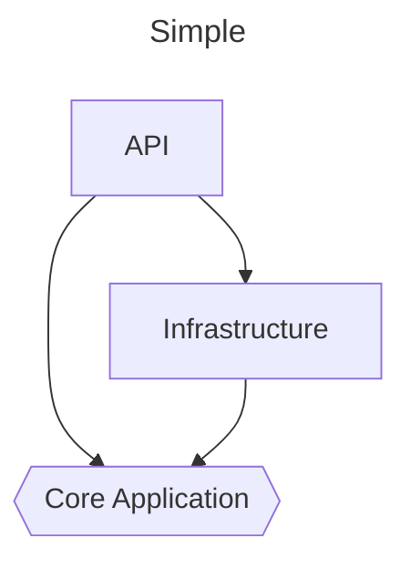
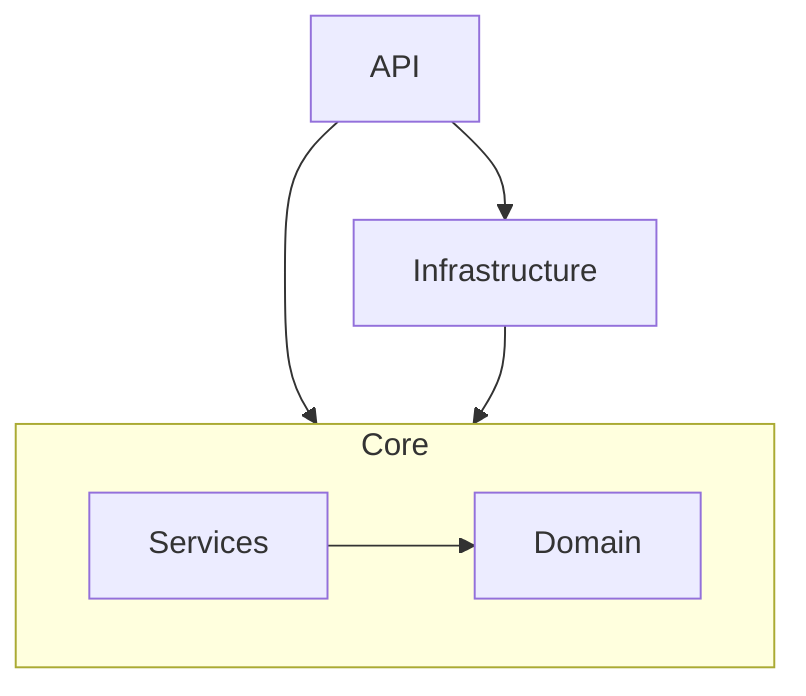
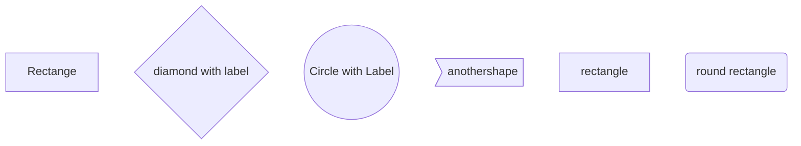

## Architecture
---

---

Here TD represents the Top to Down. The other values we can use are
1. TD or TB - Top to bottom or down
1. BT -Bottom to top
1. RL - Right to Left
1. LR - Left to Right

## Different Shapes
---

