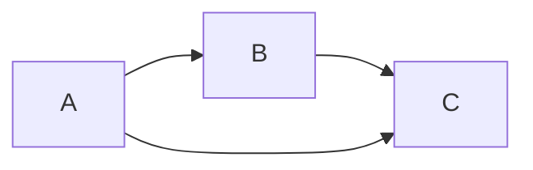
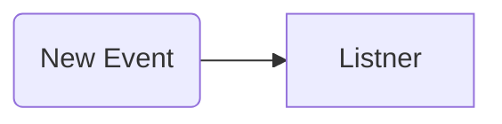
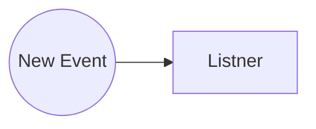
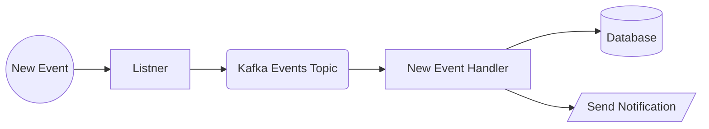

## FlowChart

```Csharp

````


```mermaid
flowchart LR
    A --> B
    B --> C
    A --> C

```

# Without Label


```mermaid
flowchart LR
   
   Trigger(New Event) --> Listner

```
# Assign a Label

```mermaid
flowchart LR
   
   Trigger(New Event) --> Listner

```

# Circle

```mermaid
flowchart LR
   
   Trigger((New Event)) --> Listner

```

# more shapes

```mermaid
flowchart LR
    Trigger((New Event)) --> Listner
    Listner --> Kafka(Kafka Events Topic)
    Kafka --> Handler[New Event Handler]
    Handler --> db[(Database)]
    Handler --> mail[/Send Notification/]

```
