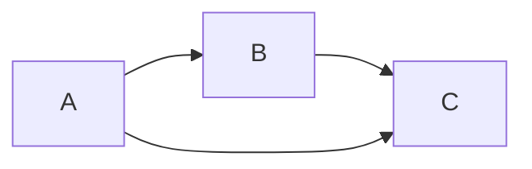
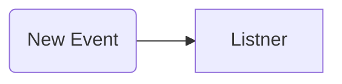
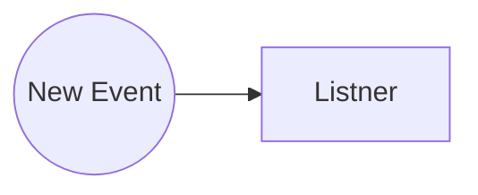
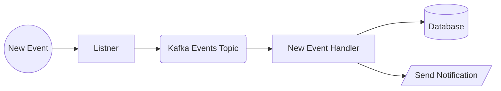
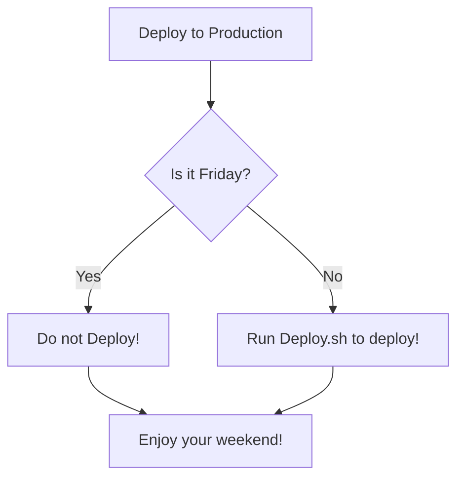

## FlowChart

```Csharp

````



# Without Label


# Assign a Label


# Circle


# more shapes



# decision making


# With hyyperlink and Tooltip
```mermaid
flowchart LR;
    A-->B;
    B-->C;
    C-->D;
    click A callback "Tooltip for a callback"
    click B "http://www.github.com" "This is a tooltip for a link"
    click A call callback() "Tooltip for a callback"
    click B href "http://www.github.com" "This is a tooltip for a link"

    ```
