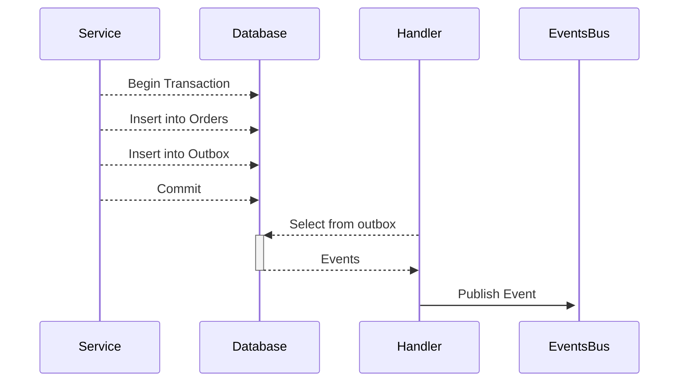
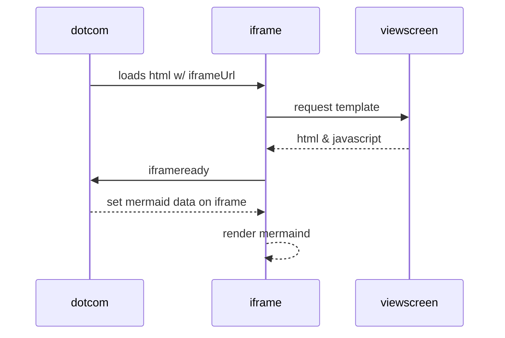
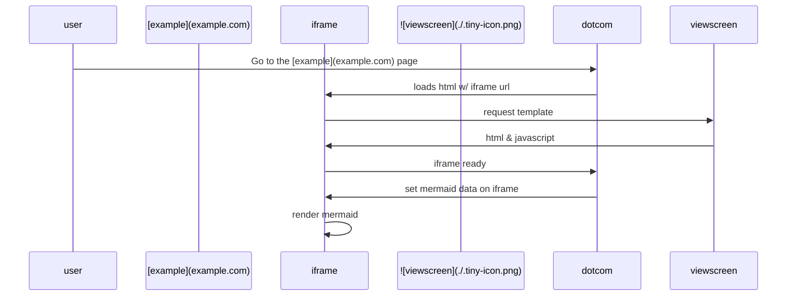

# Sequence Diagrams

```mermaid
sequenceDiagram
    Service -->>Database: Begin Transaction
    Service -->>Database: Insert into Orders
    Service -->>Database: Insert into Outbox
    Service -->>Database: Commit
    Handler -->> +Database: Select from outbox
    Database -->>- Handler: Events
    Handler ->> +EventsBus: Publish Event

```

# Another Example

```mermaid
sequenceDiagram
    participant dotcom
    participant iframe
    participant viewscreen
    dotcom ->> iframe: loads html w/ iframeUrl
    iframe ->> viewscreen: request template
    viewscreen -->>iframe: html & javascript
    iframe ->> dotcom: iframeready
    dotcom -->> iframe: set mermaid data on iframe
    iframe -->> iframe: render mermaind

```
# Another Example

```mermaid
sequenceDiagram
    participant user
    participant [example](example.com)
    participant iframe
    participant ![viewscreen](./.tiny-icon.png)
    user->>dotcom: Go to the [example](example.com) page
    dotcom->>iframe: loads html w/ iframe url
    iframe->>viewscreen: request template
    viewscreen->>iframe: html & javascript
    iframe->>dotcom: iframe ready
    dotcom->>iframe: set mermaid data on iframe
    iframe->>iframe: render mermaid
```
