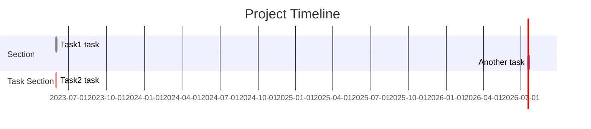
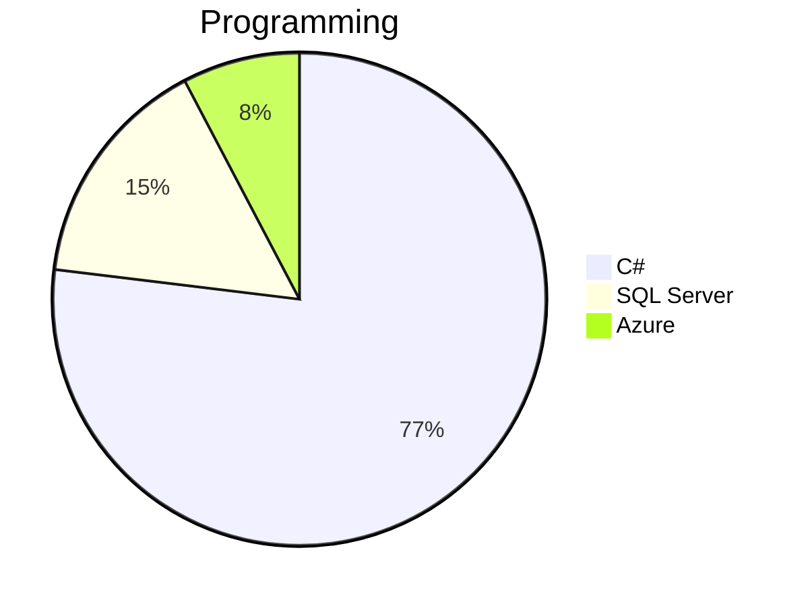

# Gant Chart

```mermaid
gantt
title Project Timeline
dateFormat YYYY-MM-DD
section Section
Task1 task  : done,a1,2023-05-31,2d
Another task : after Task1, 2d

section Task Section
Task2 task : crit,done,s1,2023-05-31,2d

```

# Pie Chart

```mermaid
pie title Programming
    "C#":50
    "SQL Server":10
    "Azure":5
```
