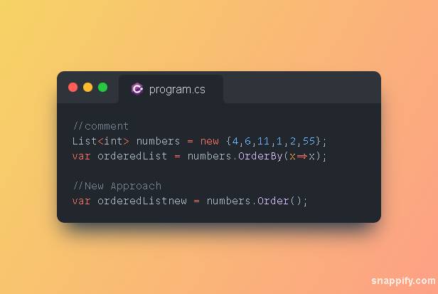

[Create Table of Contents for the below Content]: #
# Table of Contents
- [Table of Contents](#table-of-contents)
- [Heading1](#heading1)
  - [Heading2](#heading2)
    - [Heading3](#heading3)
        - [Heading4](#heading4)
          - [Heading5](#heading5)
  - [comment: Draw a horizontal line:](#comment-draw-a-horizontal-line)
    - [Horizontal Line](#horizontal-line)
- [Text Formatting](#text-formatting)
  - [Code Block Formatting. Below is c#](#code-block-formatting-below-is-c)
      - [Inline code](#inline-code)
    - [Fenched code](#fenched-code)
- [**List**](#list)
  - [Ordered List](#ordered-list)
  - [UnOrdered List](#unordered-list)
  - [Bulleted Lists](#bulleted-lists)
    - [Some Emoji](#some-emoji)
- [**Table**](#table)
  - [Task List](#task-list)
- [*Images*](#images)
  - [Icons from Devicons](#icons-from-devicons)
- [Build URL from Referene](#build-url-from-referene)
    - [References which can be used in the markdown](#references-which-can-be-used-in-the-markdown)


[comment: Different heading formats supported]: # 
# Heading1
## Heading2
### Heading3
##### Heading4
###### Heading5

[comment: Draw a horizontal line]: #
---
### Horizontal Line
---

[Different Text formats]: #
# Text Formatting
**Bold** and one more __bold__ text

*ItalicText* and one more _Italic_ option

***bold and Italic text***

~~stike Through text~~


> Test

[code block we can use]: #
## Code Block Formatting. Below is c#
---

#### Inline code
`Console.WriteLine("Test block");` 

### Fenched code
**C#**:

```Csharp
List<int> numbers = new {3,6,9,77,32,12};
var ascendingOrder = numbers.OrderBy(x=>x);
//new Approach
var ascendingNew = numbers.Order();
````

```powershell
npm install -g Azurite
```

**HTML**:
```html
<div class="col6">
    <table>
        <tr>
            <td>Heading</td>
        </tr>
    </table>
</div>
```

Some of the supported languages

- csharp
- javascript
- bash
- java
- python
- sql
- xml
- yaml
- csv


[MyBlog](https://rmanimaran.wordpress.com)

# **List**

## Ordered List
1. Item1
1. Item2
2. Item3

## UnOrdered List
- Item 1
- Item 2
- Item 3

## Bulleted Lists
* Bullet 1 
* Bullet 2
* Bullet 3
---
### Some Emoji
Fun: :joy:

Thumbsup: :thumbsup:

---

# **Table**
| **Heading1** | **Heading2** | **Heading3** |
| :--- | :----: | --: |
|text1|text2|text3|
|leftalign|center align|rightalign|
|10|10|10|

---

## Task List
- [x] Action Item 1
- [x] Action Item 2
- [ ] Pending Action Item 3 


# *Images*
Below is the image displayed from repository



## Icons from [Devicons](https://devicon.dev/)

> ##### 


          

# Build URL from Referene


My GitHub Url from below reference: [Github]


### References which can be used in the markdown
---

[Github]: https://github.com/r-manimaran 'Maran GitHub'
[Blog]: https://rmanimaran.wordpress.com 'Maran Blog'


